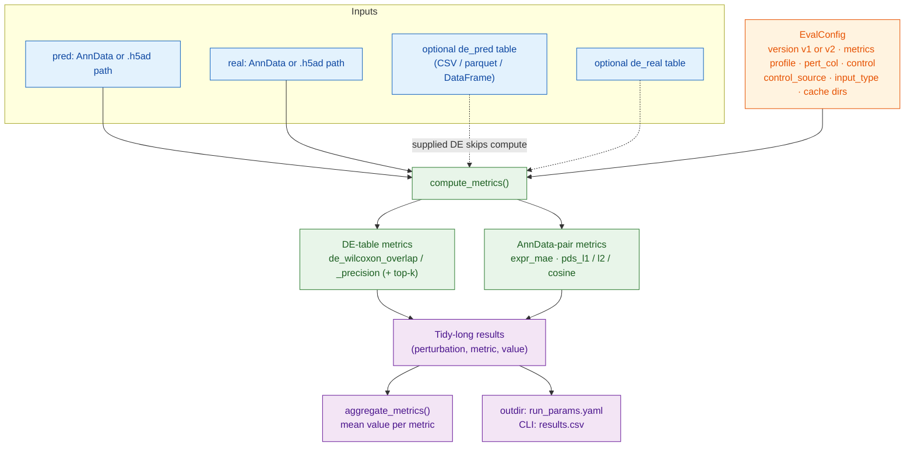
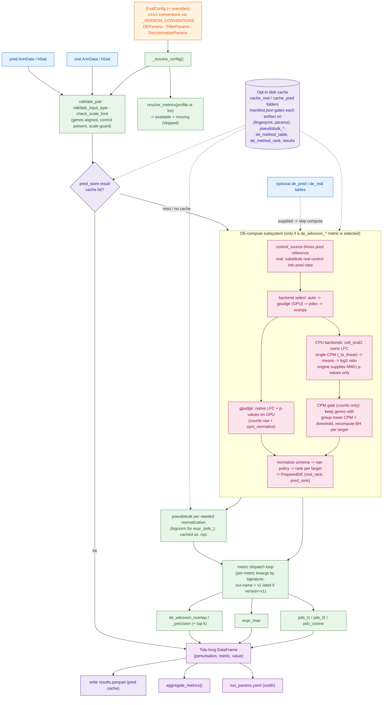

# cell_eval2 evaluation pipeline — architecture flowcharts

Three Mermaid flowcharts of the `cell_eval2` evaluation pipeline at increasing
levels of detail. Each shows **inputs → configs → data flow → outputs**; together
they tell one zoom story: whole pipeline → DE-compute subsystem → function-level.

- **Snapshot:** `main` @ `8345a02` (after PR #12, the single-CPM-normalization
  optimization). Verified against `run.py`, `de_compute.py`, `de.py`, `config.py`,
  `cache.py`, `catalog.py`, `norm.py`, and `metrics/{de,delta,discrimination}.py`.
- These diagrams describe the **implemented** surface. The `full` profile also lists
  metrics that are not yet implemented (`delta_*`, `edistance_pearson`,
  `clustering_agreement`, and most `de_wilcoxon_*` beyond overlap/precision); those
  are resolved as "missing" and skipped with a warning.

---

## 1. Low detail — bird's-eye view

What goes in, what `compute_metrics` produces, what comes out.

---

## 2. Medium detail — subsystems

The major subsystems inside `compute_metrics`: config resolution, input
normalization/validation, the opt-in disk cache, the **DE-compute path** (backend
select; LFC + p-values + CPM gate), pseudobulk, the metric families, and outputs.

---

## 3. High detail — function / data-flow level

The concrete call graph: `run.py` orchestration, the `de_compute.py` compute path
(single-CPM as built in PR #12), the `de.py` consume path, and metric dispatch.
Config objects feeding each stage are shown on the right.

```mermaid
flowchart TB
    classDef run fill:#e8f5e9,stroke:#2e7d32,color:#1b5e20;
    classDef dec fill:#fce4ec,stroke:#ad1457,color:#880e4f;
    classDef cons fill:#e1f5fe,stroke:#0277bd,color:#01579b;
    classDef met fill:#fff8e1,stroke:#f9a825,color:#f57f17;
    classDef cfg fill:#fff3e0,stroke:#e65100,color:#e65100;
    classDef cache fill:#ede7f6,stroke:#4527a0,color:#311b92;
    classDef out fill:#f3e5f5,stroke:#6a1b9a,color:#4a148c;
    classDef io fill:#e3f2fd,stroke:#1565c0,color:#0d47a1;

    %% ---------- run.py orchestration ----------
    subgraph RUN["run.py :: compute_metrics -> _run_metrics"]
        direction TB
        R0["_resolve_config(config, overrides) -> cfg"]:::run
        R1["load_anndata(pred, real) (backed for paths)"]:::run
        R2["validate_pair · validate_input_type · check_scale_limit"]:::run
        R3["resolve_metrics(cfg.metrics) -> names, missing"]:::run
        R4["fingerprint_adata(real, pred) if caching"]:::run
        R5{"result cache hit?<br/>(pred_store)"}:::cache
        R6{"any kind == de metric?"}:::run
        R0 --> R1 --> R2 --> R3 --> R4 --> R5
        R5 -- "miss" --> R6
    end

    %% ---------- DE compute side (computed only when a side's DE table is NOT supplied) ----------
    DEIN["optional de_pred / de_real tables<br/>(supplied -> skip compute)"]:::io
    R6 -- "yes (compute if not supplied)" --> DREAL["_compute_de_side(real_ad)"]:::run
    R6 -- "yes (compute if not supplied)" --> DPREDIN["_pred_de_input(pred_ad, real_ad)<br/>control_source=real: concat(pred non-ctrl, real ctrl)"]:::run
    DPREDIN --> DPRED["_compute_de_side(pred_de_in)"]:::run

    DREAL --> CDE
    DPRED --> CDE

    subgraph DECOMP["de_compute.py :: compute_de"]
        direction TB
        CDE["_resolve_backend(auto->gpudge->pdex->scanpy)<br/>validate reference / groups / input_type / mean_calc<br/>skip CPM gate if input_type != counts"]:::dec
        CDE --> BR{"backend?"}:::dec
        BR -- "gpudge" --> GP["_de_gpudge(): native LFC + p-values<br/>counts raw (cpm_normalize); lognorm -> _to_linear first"]:::dec
        BR -- "pdex / scanpy" --> LIN["_to_linear(input_type)<br/>counts: normalize_total(1e6) · lognorm: expm1<br/>== single CPM source"]:::dec
        LIN --> GM["_group_means_linear(mean_calc)<br/>arithmetic: mean(X) · geometric: expm1(mean(log1p X))"]:::dec
        GM --> LFC["_lfc_from_means()<br/>log2((mean_t + eps)/(mean_ref + eps))"]:::dec
        LIN --> LOGV["_log1p_view(linear) [counts]<br/>or adata copy/ref [lognorm]"]:::dec
        LOGV --> PV["_de_scanpy_pvalues / _de_pdex_pvalues<br/>MWU p_value + p_adj only (LFC discarded)"]:::dec
        LFC --> JOIN["join LFC + p-values on (target, feature)"]:::dec
        PV --> JOIN
        JOIN --> AF["_apply_cpm_filter() [counts only]<br/>keep mean CPM > thr; recompute BH per target"]:::dec
        AF --> NS["normalize_de_schema(name)"]:::dec
        GP --> NS
    end

    %% ---------- de.py consume path ----------
    NS --> CONS
    DEIN -. "supplied" .-> CONS
    subgraph CONSUME["run.py :: _prepare_de_cached -> de.py (per side)"]
        direction TB
        CONS["load_de_table -> normalize_de_schema<br/>(fdr->p_adj, derive abs LFC, required-col + null check)"]:::cons
        CONS --> NP["apply_nan_policy (v1 keep / v2 mask -> p_adj=1)"]:::cons
        NP --> PDS2["prep_de_side -> (df, perts)"]:::cons
        PDS2 --> RANK["rank_de_side / _rank_matrix<br/>filter p_adj < threshold; ordinal rank by sort_by;<br/>pivot rank x target"]:::cons
        RANK --> PREPDE["assemble_prepared_de -><br/>PreparedDE(real_rank, pred_rank, perturbations)"]:::cons
    end

    %% ---------- pseudobulk + dispatch ----------
    R6 -- "always" --> PB["_side_bulks(real, pred)<br/>to_normalization + pseudobulk per norm (cached .npz)"]:::run
    PREPDE --> DISP
    PB --> DISP

    subgraph DISPATCH["metric dispatch (per name; signature-filtered kwargs)"]
        direction TB
        DISP["out_name = v1_name if version=v1 else canonical"]:::run
        DISP --> MDE["metrics/de.py :: de_overlap(prepared, k, metric)"]:::met
        DISP --> MEXP["metrics/delta.py :: mae(pred_bulk, real_bulk)"]:::met
        DISP --> MPDS["metrics/discrimination.py :: discrimination_score(... distance)"]:::met
    end

    MDE --> TIDY["Tidy-long DataFrame<br/>(perturbation, metric, value)"]:::out
    MEXP --> TIDY
    MPDS --> TIDY
    R5 -- "hit" --> TIDY
    TIDY --> WR["pred_store.put(results) · to_yaml(run_params.yaml)"]:::out
    TIDY --> AGG["aggregate_metrics() -> mean per metric"]:::out

    %% ---------- config objects ----------
    subgraph CFGS["Config objects (config.py)"]
        direction TB
        EC["EvalConfig<br/>version · metrics · pert_col · control<br/>control_source · input_type · max_counts_per_cell<br/>cache_real/pred/strict · num_threads · outdir"]:::cfg
        DEP["DEParams<br/>backend · mean_calc · epsilon · sort_by<br/>p_adj_threshold · method · nan_lfc_policy"]:::cfg
        FP["FilterParams<br/>filter_gene_min_cpm_cell (v2=5, v1=None)"]:::cfg
        DP["DiscriminationParams<br/>distance · rank_denominator · exclude_target_gene"]:::cfg
    end

    EC -.-> R0
    DEP -.-> CDE
    FP -.-> AF
    DP -.-> MPDS

    %% ---------- cache ----------
    CACHE[("CacheStore (cache.py)<br/>manifest.json + atomic writes<br/>fingerprint_adata / fingerprint_de_table<br/>pseudobulk_* · de_method_table · de_method_rank · results")]:::cache
    CACHE -.-> DREAL
    CACHE -.-> DPRED
    CACHE -.-> PB
    CACHE -.-> RANK
    CACHE -.-> R5
```

---

## Legend

| Color | Meaning |
|-------|---------|
| Blue | Inputs (AnnData / DE tables) |
| Orange | Config objects (`EvalConfig`, `DEParams`, `FilterParams`, `DiscriminationParams`) |
| Green | `run.py` orchestration |
| Pink | `de_compute.py` DE-compute path |
| Light blue | `de.py` DE consume path / `PreparedDE` |
| Yellow | metric functions (`metrics/*`) |
| Purple (rounded) | opt-in disk cache (`cache.py`) |
| Lavender | outputs (tidy results, aggregate, YAML/CSV) |

### Key invariants (as built)

- **Single CPM source (PR #12):** on the counts CPU path, one
  `sc.pp.normalize_total(target_sum=1e6)` (`_to_linear`) feeds the LFC means, the
  log1p p-value view (`_log1p_view`), and the CPM gate — no second normalization.
- **cell_eval2 owns the log2FC uniformly** across CPU backends and versions; pdex /
  scanpy supply only rank-based MWU p-values. gpudge computes its matching LFC
  natively on GPU.
- **v1 vs v2** differ only in conventions from `_VERSION_CONVENTIONS` (control_source,
  input_type, mean_calc, epsilon, CPM filter, NaN policy, PDS distance/denominator)
  and the output metric-name labels. `EvalConfig() == EvalConfig.v2()`.
